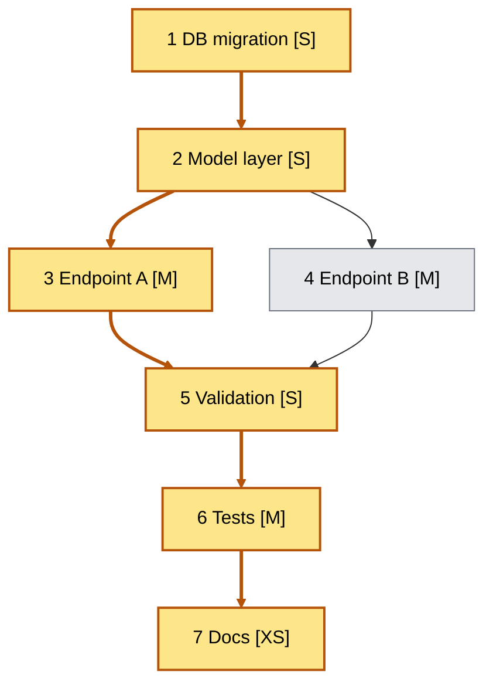

# Create Tasks Decomposition

Breaks down a feature, plan, or specification into discrete, actionable tasks.
Each task gets its own file under `.sdlc/features/N-<slug>/tasks/` with a unique sequence number, frontmatter status, and explicit dependencies.

## Prerequisites

- Apply the shared SDLC conventions in `skills/sdlc/references/shared.md`.
- If no argument is provided, locate the feature directory under `.sdlc/features/` whose frontmatter `issue` field references `$ISSUE_NUMBER`.
- `.sdlc/features/N-<slug>/plan.md` (must have passed review with findings verdict `approved`), or an implementation plan/specification provided in context or as a file path (`$1`)

## Task Sizing Guidelines

| Size | Effort | Description |
|---|---|---|
| XS | < 2h | Configuration change, single-file edit |
| S | 0.5d | Small feature, single component |
| M | 1d | Moderate feature, 2–5 files |
| L | 2d | Complex feature, multiple components |
| XL | > 2d | Must be broken down further |

Tasks estimated XL must be decomposed into smaller tasks before being considered actionable.

## Steps

1. Read the plan or specification.
2. Identify all units of work, targeting tasks completable in 0.5–2 days each.
3. For each task, define: description, acceptance criteria, effort size, and dependencies on other tasks.
4. Order tasks and assign sequence numbers starting at `1` within this feature.
5. Identify the critical path through the dependency graph (the chain with the greatest total effort).
6. Write one file per task to `.sdlc/features/N-<slug>/tasks/N-<slug>.md`, where `N` restarts at `1` for each feature.
7. Output the summary: task table followed by a Mermaid dependency graph with the critical path highlighted (see Output Format below).

## Output Format (one file per task)

Use the template at `skills/sdlc/templates/features/task.md` (copied to `.sdlc/templates/features/task.md` by `/initialize-sdlc-directory`; use the project's customized copy if present). Write one file per task to `.sdlc/features/N-<slug>/tasks/<id>-<slug>.md`.

### Task Status Lifecycle

Tasks follow a strict status progression:

```
draft → pending → in-progress → done
                   |                 ↑
                   → blocked ────────┘
                   |                 |
                   → cancelled       |
                                     ↓
                              (restart if needed)
```

| Status | Meaning | Who sets it |
|---|---|---|
| `draft` | Initial state, created by decomposition | `create-tasks-decomposition` |
| `pending` | Reviewed and approved, ready to start | `review-tasks-decomposition` |
| `in-progress` | Actively being worked on | `create-implementation` (or manually) |
| `blocked` | Cannot proceed due to external dependency or issue | `create-implementation` (or manually) |
| `done` | All acceptance criteria met, tests passing | `create-implementation` after checklist passes |
| `cancelled` | No longer needed (superseded or descoped) | Manually |

When setting a task to `done`, also set `completed_date` to the current date (ISO format, e.g. `2025-6-5`).
When setting a task to `blocked`, also set `blocker` to a brief description of what is blocking (e.g. `"Waiting on API access from infra team"`).
When a blocked task resumes, set status back to `in-progress` and clear `blocker` to `null`.

After writing all task files, output a summary to the conversation. It has two parts: a task table and a dependency graph.

**1. Task table**, in this format:

```markdown
## Tasks created: <Feature Name>

| ID | Title | Size | Depends on |
|---|---|---|---|
| 1 | <title> | S | — |
| 2 | <title> | M | 1 |

**Critical path:** 1 → 2 → 5 → 8

**Total:** N tasks — X person-days estimated
```

**2. Dependency graph.** Render the full task dependency graph as a Mermaid `flowchart TD` (top-down), highlighting the critical path. Emit it as a fenced `mermaid` block immediately after the table.

- Each task is one node labeled `"ID Title [Size]"`.
- Draw one edge per declared dependency (`depends_on`), directed from dependency to dependent.
- Critical-path nodes get the `critical` class; all other nodes get the `normal` class.
- Critical-path edges are thick and colored via `linkStyle`, listing their 0-based indices in edge-definition order.

Example (for the API feature in Scenario 1 below):



Computing the critical path:

- Convert each task `size` to person-days: XS=0.25, S=0.5, M=1, L=2.
- The critical path is the dependency chain with the greatest total effort. On ties, pick the chain ending at the latest task.
- `linkStyle` indices follow edge-declaration order, starting at 0; list only critical-path edges.
- Keep node labels short (titles may be abbreviated) so the graph stays readable.
- If the graph is a single linear chain, the diagram may be omitted in favor of the `**Critical path:**` line in the table.

## Outcome

If `$OUTCOME_YAML` is set, emit `verdict: approved` there per `skills/sdlc/references/shared.md`, If the decomposition could not be produced, omit the file.

## Example Usage

**Scenario 1: API feature**
Plan has three phases.
Tasks: 1 DB migration `[S]`, 2 model layer `[S]` (depends 1), 3 endpoint A `[M]` (depends 2), 4 endpoint B `[M]` (depends 2), 5 validation `[S]` (depends 3, 4), 6 tests `[M]` (depends 5), 7 docs `[XS]` (depends 6).
Critical path: 1 → 2 → 3 → 5 → 6 → 7 (its Mermaid graph is the example in Output Format above).

**Scenario 2: Oversized task**
A task described as "implement the entire payment module" is XL.
Break into: 1 payment intent `[M]`, 2 webhook handler `[M]`, 3 refund endpoint `[S]`, 4 idempotency `[S]`, 5 integration tests `[M]`.

## Next Step

Run `/review-tasks-decomposition` to audit granularity, completeness, and dependencies before moving on.
Once tasks are approved, continue with `/create-tests`.

## Useful Commands Reference

No CLI commands required. This skill operates on document content provided in context.
