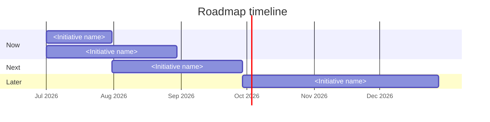

# Roadmap

## Strategy Summary

<One paragraph stating the strategic direction for this period: the main bets, the primary objectives they advance, and the constraints (capacity, dependencies, hard deadlines).>

## Horizon Model

- **Horizon scheme:** <Now / Next / Later, or quarter-based (2026 Q3, Q4, ...)>
- **Current period:** <e.g., 2026 Q3>
- **Now horizon:** <what "now" covers, e.g., in-flight and starting this quarter>
- **Next horizon:** <roughly next 1-3 months>
- **Later horizon:** <exploratory, future, hypothesis-level>

## Themes

- <Recurring strategic theme tied to a `goals.md` objective, e.g., "Reliability: earn the right to scale" (advances Objective 1).>
- <e.g., "Activation: turn signups into habituated users" (advances Objective 2).>

## Now

<Committed, in-flight, or starting this horizon. Fully scoped, with owners, dependencies, and a success signal.>

### <Initiative name>

- **Objective:** <which `goals.md` objective / key result this advances>
- **Owner:** <team or person>
- **The bet:** <hypothesis: if we do this, <outcome> improves because <reason>>
- **Scope:** <what is in and out of this initiative>
- **Roll-up:** <FEAT-N or issue references that belong to this initiative>
- **Dependencies:** <what must complete first, internal or external>
- **Confidence:** High / Medium / Low
- **Success signal:** <how we will know it worked; ties to a key result or KPI>

## Next

<Planned for the following horizon. Roughly scoped; may move between horizons as we learn.>

### <Initiative name>

- **Objective:** <which `goals.md` objective / key result this advances>
- **Owner:** <team or person>
- **The bet:** <hypothesis>
- **Scope:** <rough outline>
- **Dependencies:** <sequencing constraints>
- **Confidence:** High / Medium / Low
- **Success signal:** <how we will know it worked>

## Later

<Exploratory and future. Hypothesis-level only, low confidence; included to show direction, not commitment.>

### <Initiative name>

- **Objective:** <which `goals.md` objective / key result this advances>
- **The bet:** <hypothesis>
- **Confidence:** Low
- **Open questions:** <what we need to learn before this can move to Next>

## Sequencing and Dependencies

| From | Depends on | Type | Notes |
|---|---|---|---|
| <Initiative or FEAT-N> | <Initiative or FEAT-N> | <hard / soft / external> | <context> |

## Timeline

<Optional: a Mermaid Gantt chart visualizing the initiatives across the horizons. Anchor dates to the current period start and use approximate spans, not hard commitments, since horizons are estimates. Use `after <id>` to mark dependencies.>

## Not Now

- <Deliberately deferred work and why: waiting on evidence, capacity, a dependency, or a strategic shift. State the condition that would promote it to Now or Next.>

## Capacity and Constraints

- **Capacity:** <known team capacity for the Now horizon, if stated>
- **Hard constraints:** <regulatory deadlines, fixed external dates, frozen periods>

## Review Cadence

- **Review frequency:** <e.g., monthly>
- **Last reviewed:** <date>
- **Next review:** <date>

## Open Questions

1. <Unresolved question about sequencing, scope, or evidence>
