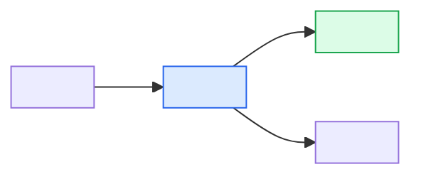

# Codebase Analysis: <Feature Name>

## Overview

<One paragraph summarizing the relevant existing code/architecture and the overall changeability outlook.>

## Scope of Analysis

<Which areas were examined, the search entry points used (queries and paths), and what was explicitly out of scope. State "greenfield" here if no relevant existing code exists.>

## Relevant Existing Components

| Component | Path | Responsibility | Interaction |
|---|---|---|---|
| <name> | <file/module path> | <what it does today> | Reuse / Extend / Refactor / Replace / Read-only |

## Dependency and Coupling Map

Node classes match the change dispositions from the Changeability Assessment below (reuse / extend / refactor / replace).
External systems appear as plain nodes.

<Prose call-outs for tight coupling, shared state, synchronous vs. asynchronous boundaries, and the blast radius of a change. A component claimed to be loosely coupled but drawn with edges to every neighbor is visible here in two seconds.>

## Changeability Assessment

### <Component Name>

- **Current state:** <how it works today>
- **Change disposition:** Reuse as-is / Extend / Refactor / Replace
- **Rationale:** <why this disposition, tied to the requirements and the coupling map>
- **Risk:** Low / Medium / High — <what drives it>
- **Constraints:** <what must not change, e.g. public API, persisted data format, ordering guarantees, behavior contracts>

## Migration and Impact Considerations

<For every Refactor or Replace disposition: the path from current to target behavior, backward compatibility, rollout strategy, what else breaks, and how to de-risk. Omit this section if the analysis is greenfield or contains only Reuse/Extend dispositions.>

## Assumptions About Existing Code

- <Belief about current behavior the analysis relies on but has not fully verified. Promote risky ones via /create-assumption.>

## Open Questions

1. <Question that needs an answer before the design can rely on this analysis.>
