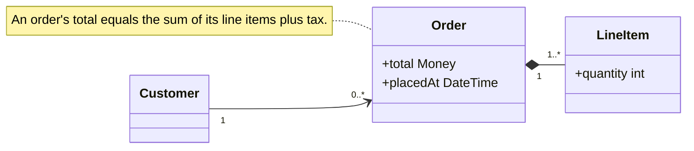

# Domain Model: <Domain Name>

## Domain Overview

<One paragraph describing the domain this model covers and why it matters for understanding the system.>

## Entities

| Entity | Description | Key attributes |
|---|---|---|
| <noun> | <what it is in the domain> | <attributes that matter for this problem> |

## Relationships

| From | Relationship | To | Cardinality | Notes |
|---|---|---|---|---|
| <entity> | <verb / relation> | <entity> | one-to-many / many-to-many / ... | <constraint or rule> |

## Entity Model

One class per entity with its key attributes; edges carry cardinality; composition (`*--`) for whole-part relationships.
Each invariant attaches as a `note` on the entity it constrains, so a rule floating free of its entity is visible immediately.

## Glossary

<Reuse terms from `.sdlc/context/vocabulary.md` where they exist. Disambiguate any overloaded term.>

| Term | Definition | Disambiguation |
|---|---|---|
| <term> | <precise meaning in this domain> | <distinguishes it from related or overloaded terms, if any> |

## Invariants

<Rules that always hold in this domain. These are testable constraints, not implementation details.>

- <invariant, e.g., "An order's total equals the sum of its line items plus tax.">

## Key Quantities and Metrics

| Quantity | Why it matters | Current value (if known) |
|---|---|---|
| <metric the problem turns on> | <how it relates to the problem> | <value or "unknown"> |

## Boundaries

**In this domain:** <what the model covers>
**Adjacent domains (out of scope):** <neighboring domains this one touches but does not model>

## Open Questions

1. <Where the model is uncertain, or "None".>
