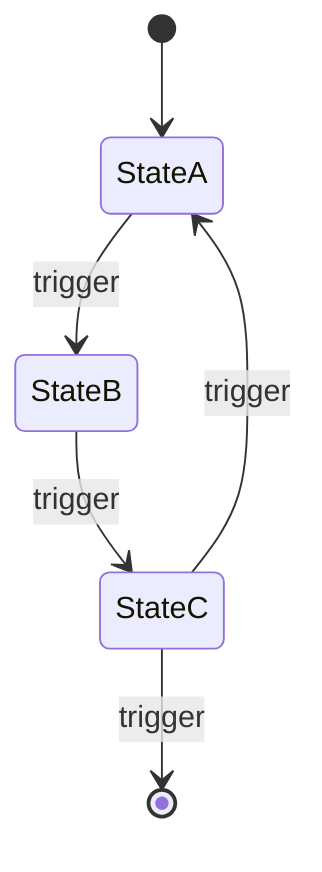

# Lifecycle: <Feature Name>

## Overview

<One paragraph describing which resources this feature manages and why their lifecycle matters.>

## Resources

| Resource | Description | Lifecycle Type | Spec Ref |
|---|---|---|---|
| <resource name> | <what it represents> | State Machine / Linear / CRUD | <specification.md section> |

## State Diagrams

### <Resource Name>

## States

### <Resource Name>

| State | Description | Entry Condition | Exit Condition | Spec Ref |
|---|---|---|---|---|
| <state name> | <what being in this state means> | <how the resource enters this state> | <what causes it to leave> | <specification.md section or API endpoint> |

## Transitions

### <Resource Name>

| From | To | Trigger | Actor | Side Effects | Guard Conditions | Spec Ref |
|---|---|---|---|---|---|---|
| <state> | <state> | <event, API call, timer, or condition> | <user, system, or external> | <notifications, cascading updates, emissions> | <preconditions that must hold> | <specification.md section or API endpoint> |

## Invariants

| Resource | Invariant | Enforced By | Violation Handling |
|---|---|---|---|
| <resource name> | <condition that must always hold, e.g., "cannot be in 'active' without a valid payment method"> | <DB constraint, application logic, or API validation> | <what happens if violated: error, rollback, alert> |

## Retention and Expiry

| Resource | Retention Policy | Expiry Trigger | Cleanup Action | Spec Ref |
|---|---|---|---|---|
| <resource name> | <how long it persists, e.g., "90 days after deletion"> | <what starts the clock, e.g., "soft delete timestamp"> | <hard delete, archive, anonymize> | <specification.md section> |

## Event Emissions

| Transition | Event | Payload | Consumer | Spec Ref |
|---|---|---|---|---|
| <from> -> <to> | <event name> | <fields included> | <downstream system or webhook> | <specification.md section or telemetry.md event> |

## Out of Scope

- <What lifecycle aspects are explicitly not covered here and why>
