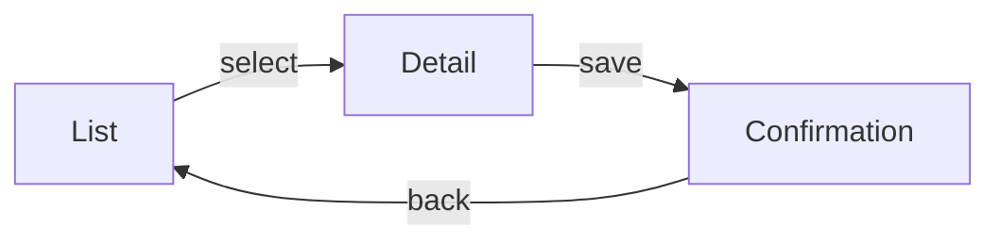

# Mockups: <Feature Name>

## Overview

<One paragraph describing the UI surface, the primary user, and the main goal of the screens. State that the per-screen HTML mockups live under `mockups/`.>

## Screen Inventory

| Screen | Purpose | Entry From | Exits To | Mockup |
|---|---|---|---|---|
| <name> | <what the user does here> | <where they came from> | <where they can go> | [`mockups/<screen-slug>.html`](mockups/<screen-slug>.html) |

## Wireframes

### <Screen 1>

**Mockup:** [`mockups/<screen-slug>.html`](mockups/<screen-slug>.html)

**Regions**

| Region | Content | Data source (spec ref) |
|---|---|---|
| <region name> | <what it shows> | <specification.md section or API endpoint> |

**Primary action:** <the single most important action on this screen>

### <Screen 2>

...

## Component Breakdown

| Component | Status | Notes |
|---|---|---|
| <name> | Reuse / Extend / New | <where it lives or what it needs> |

## Interaction States

### <Component or Screen>

| State | What the user sees |
|---|---|
| Empty | <placeholder, zero-data state> |
| Loading | <skeleton or spinner> |
| Populated | <happy path> |
| Error | <failure messaging and recovery> |

## Navigation Flow

## Responsive Behavior

| Viewport | Layout changes |
|---|---|
| Mobile (<640px) | <what collapses, reorders, or hides> |
| Tablet (640-1024px) | <changes> |
| Desktop (>1024px) | <changes> |

## Accessibility

- **Keyboard:** <focus order, shortcuts, traps to avoid>
- **Screen reader:** <labels, landmarks, live regions>
- **Contrast:** <target ratio, e.g. WCAG AA 4.5:1>
- **Touch targets:** <minimum size, spacing>

## Copy Notes

- <placeholder text the writer must fill, marked so layout is not disturbed>

## High-Fidelity Needs

- <Where a static HTML mockup is insufficient (motion, drag-and-drop, canvas, interactive prototype) and a Figma file or clickable prototype is warranted, with a pointer or request>

## Out of Scope

- <What is explicitly not designed here and why>
