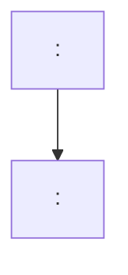
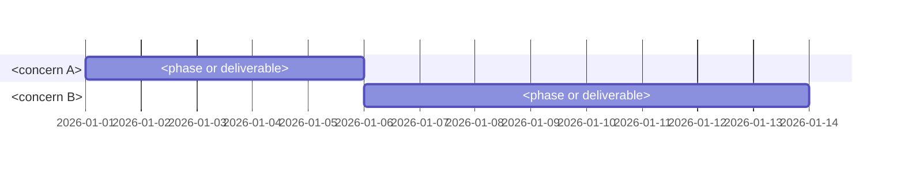

# Implementation Plan: <Feature Name>

## Goal

<One paragraph describing what this plan achieves.>

## Concerns

This plan is split by concern. Each concern has its own phased breakdown under `plan/<concern>.md`.

| Concern | Plan | Owner |
|---|---|---|
| <concern> | [plan/<concern>.md](<concern>.md) | <team or person> |

## Milestones

| Milestone | Concern | Phase | Success Criteria |
|---|---|---|---|
| M1: <name> | <concern> | Phase 1 | <Measurable condition> |

## Cross-Concern Dependencies

Cross-concern and external dependencies. (Concern-local dependencies live in each concern plan.)

| Dependency | Type | Owner | Risk if Delayed |
|---|---|---|---|
| <name> | Internal / External | <team or person> | <impact> |

## Risk Register

Aggregated across concerns. (Concern-local risks may also appear in each concern plan.)

| Risk | Likelihood | Impact | Mitigation |
|---|---|---|---|
| <description> | High / Med / Low | High / Med / Low | <action> |

## Timeline

Consolidated across concerns.
Render as a Mermaid `gantt` when calendar dates are estimable (one `section` per concern); otherwise keep a duration-only table.

