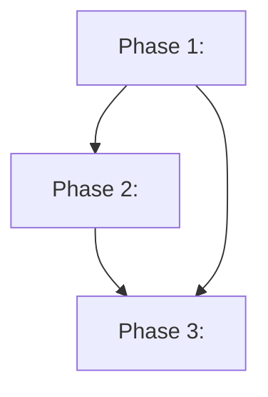
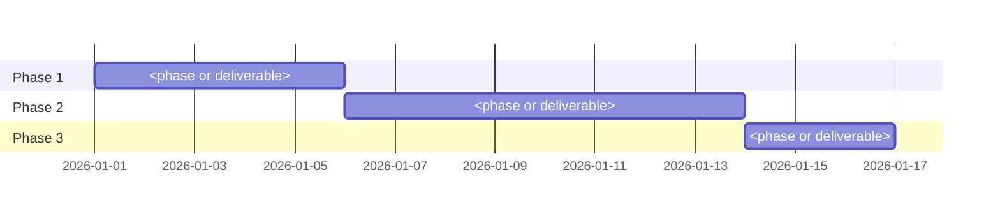

# Implementation Plan: <Feature Name>

## Goal

<One paragraph describing what this plan achieves.>

## Phases

### Phase 1: <Name>

**Goal:** <What is complete at the end of this phase.>
**Effort:** <Estimate>
**Depends on:** None

**Deliverables:**
- [ ] <Deliverable>

## Phase Dependencies

Parallel phases (no edge between them) and unintended serialization (an edge that should not exist) are visible at a glance.

## Milestones

| Milestone | Phase | Success Criteria |
|---|---|---|
| M1: <name> | Phase 1 | <Measurable condition> |

## Dependencies

| Dependency | Type | Owner | Risk if Delayed |
|---|---|---|---|
| <name> | Internal / External | <team or person> | <impact> |

## Risk Register

| Risk | Likelihood | Impact | Mitigation |
|---|---|---|---|
| <description> | High / Med / Low | High / Med / Low | <action> |

## Assumptions

- <Belief the plan depends on but has not verified. Promote risky ones via /create-assumption.>

## Timeline

Render the timeline as a Mermaid `gantt` when calendar dates are estimable, so sequencing and parallel tracks are inspectable at a glance.
When no calendar can be committed yet, keep a duration-only table instead.

