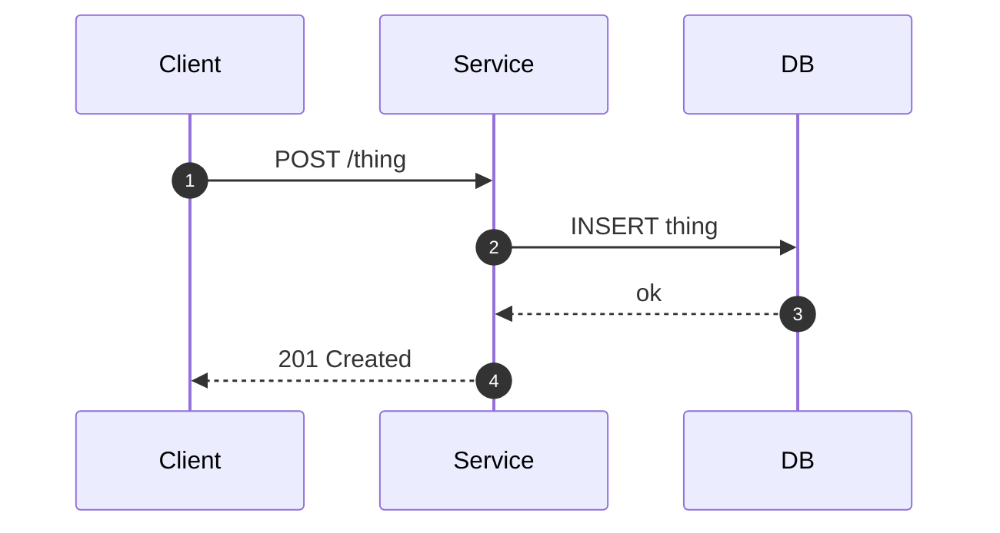

# Specification: <Feature Name>

## Overview

<One paragraph describing the technical approach.>

## Architecture

<Mermaid diagram or description showing components and their relationships.>

## Data Models

### <Entity Name>

| Field | Type | Constraints | Description |
|---|---|---|---|
| id | uuid | PK, not null | ... |

## API Contracts

The normative contract lives in [`api.yaml`](api.yaml) (OpenAPI 3), written alongside this document whenever the specification defines an API surface.
The table below is a summary; request/response schemas, error response bodies, and auth requirements live in `api.yaml`.

| Method | Path | Purpose |
|---|---|---|
| POST | /path | <one-line purpose> |

Error codes shared across endpoints:

| Status | Code | Description |
|---|---|---|
| 400 | INVALID_INPUT | ... |

## Sequences

### <Flow Name>

## Technical Decisions

| Decision | Choice | Rationale |
|---|---|---|

## Risks and Unknowns

1. <Risk or open question>

## Out of Scope

- <What is explicitly not covered by this specification>
