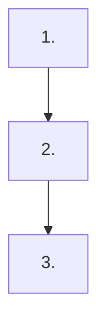

# Telemetry: <Feature Name>

## Overview

<One paragraph describing the measurement goals for this feature.>

## Success Metrics

| Metric | Target | Measurement Method | Timeframe |
|---|---|---|---|
| <metric name> | <target value or threshold> | <how it is computed> | <over what period> |

## User Funnel

One node per funnel step, labeled with the event that marks reaching it.
A step with no entry event, or a dangling node no path reaches, is visible in two seconds.

| Step | Event | Entry Criteria | Exit Criteria |
|---|---|---|---|
| 1. <step name> | <event that marks entry> | <precondition> | <what moves user to next step> |
| 2. <step name> | ... | ... | ... |

## Analytics Events

### <event_name>

**Trigger:** <When this event fires>
**Location:** <Where in the codebase this is emitted>

| Property | Type | Required | Description |
|---|---|---|---|
| <property_name> | <string/number/boolean> | Yes/No | <What this property captures> |

## Counter Metrics

| Metric | Concern | Threshold |
|---|---|---|
| <metric name> | <what negative signal it detects> | <value that triggers investigation> |

## Telemetry Requirements

| Requirement | Type | Notes |
|---|---|---|
| <requirement> | Infrastructure / Event / Dashboard | <additional context> |

## Dashboards and Alerts

- **Dashboard:** <What dashboard to create or update, and what it shows>
- **Alerts:** <Any automated alerts and their conditions>

## Out of Scope

- <What is explicitly not tracked and why>
